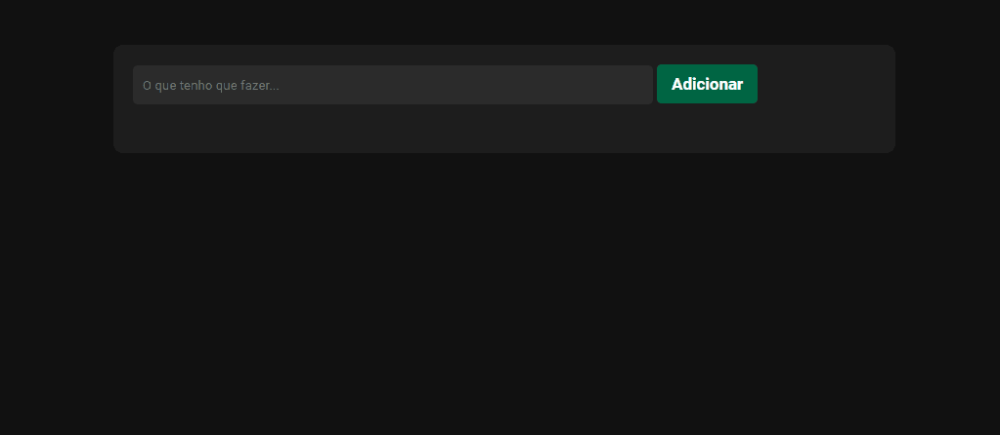

  <h1>Lista de Tarefas</h1>
  

<h2>Descrição<h2/>
  Este projeto é uma lista de tarefas (Todo List) desenvolvida em HTML, CSS e JavaScript. Permite adicionar, marcar como concluída e excluir tarefas.

<h2>Tecnologias</h2>
   - HTML
   - CSS
   - JavaScript
<h2>Como usar</h2>
   1 - Faça o clone deste repositório: git clone https://github.com/seu-usuario/nome-do-repositorio.git
   2 - Abra o arquivo index.html em seu navegador.
   3 - Utilize o campo de entrada para adicionar novas tarefas.
   4 - Clique em "Adicionar" para incluir uma nova tarefa na lista.
   Cada tarefa possui opções para marcar como concluída ou excluí-la.
   As tarefas são armazenadas localmente para persistência dos dados.
<h2>Principais Aprendizados</h2>
  - Manipulação do DOM (Document Object Model) com JavaScript.
  - Armazenamento local de dados usando o localStorage.
  - Trabalho com arrays e objetos para gerenciar a lista de tarefas.
  - Uso de eventos para responder às interações do usuário.
  - Estilização básica com CSS para uma apresentação mais amigável.

